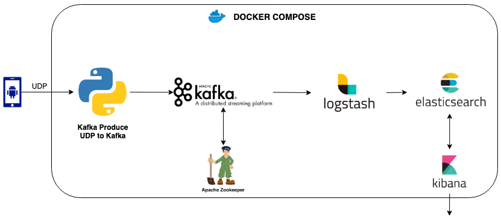

# Real-time IoT Data Streaming
Experimenting with IoT using android smartphone sensors and streaming the generated data real time to kafka and further processed, aggregated and stored using ELK stack.



> For detailed description of this project read my [Medium post](https://itnext.io/real-time-iot-data-streaming-from-old-smartphone-e9fbee6ecc91).

## Requirements:
- [Docker Engine](https://docs.docker.com/get-docker/) version 19.03 or newer
- [Docker Compose](https://docs.docker.com/compose/install/) version 1.25.5 or newer
- 3 GB of RAM allocated to docker
- Smartphone with Android OS 2.3.3 and above

## Setup

Install [Sensorstream IMU+GPS](https://play.google.com/store/apps/details?id=de.lorenz_fenster.sensorstreamgps&hl=en) in your android device. The smartphone should be connected to the same network as the machine running the docker containers.

- Open the Sensorstream IMU+GPS app
- In Preferences section update the `Target IP address` text area with the local ip of the machine running docker.
- Click in radio buttton `UDP stream` as we don't want to store a replica of data in the android phone.
- Check `Run in Background`
- In Toggle Sesnors section check `Battery Temp.` and `Include User-Checked Sesnor Data in Stream`

By default, the stack exposes the following ports:

- 5555: kafka producer UDP input
- 9093: Kafka port for host interaction
- 9200: Elasticsearch HTTP
- 9300: Elasticsearch TCP transport
- 5601: Kibana

## Execution

```sh
$ docker-compose up
```
Then click `Switch Stream` button in Sensorstream IMU+GPS app to switch on the stream.

## Querying the sensor data / Data Visualization

Open kibana in your browser using url [http://localhost:5601](http://localhost:5601)
- Click on the discover button on the left navigation bar.
- Kibana will prompt you to `Define index pattern` type `logstash-*` and press next
- Step 2 you will be asked to choose th `Time Filter field name` select `@timestamp` from the drop down and press `Create Index`
- Now go to discover section. You can see the data coming in from the android smartphone.
